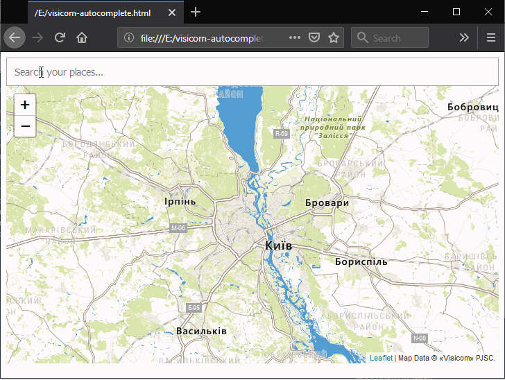

Javascript visicom-autocomplete widget
===================

An extremely lightweight and powerful geocode completion suggester.

Released under the MIT License: http://www.opensource.org/licenses/mit-license.php



## Features

* Search address, settlement, POI etc. in one autocomplete form
* Add your callbacks to suggest selection event
* Leaflet map support (zoom on selection)
* Proxy servers support to hide your API key from client side
* Coordinates parsing
* Add your custom feature objects for searching

## Installing
To use Visicom autocomplete widget you should register in our system: https://api.visicom.ua/accounts/login 

Get your API key and you are ready to use widget.

Add imports on your page:

```html
<link rel="stylesheet" href="https://raw.githubusercontent.com/visicom-api/visicom-autocomplete/master/visicom-autocomplete.min.css">
```

```html
<script src="https://raw.githubusercontent.com/visicom-api/visicom-autocomplete/master/visicom-autocomplete.min.js"></script>
```

Create element in your html file ('a' tag will dispappear, you shouldn't remove it):

```html
<div id="visicom-autocomplete">
    <a href="https://api.visicom.ua/" target="_blank">© Visicom</a>
</div>
```

Create new autocomplete object (you can specify options):
```javascript
<script>
let ac = new visicomAutoComplete({        
    apiKey : 'YOUR_API_KEY',
});
</script>
```

Now we have such options:
* apiKey - your API key (required, if you don't specify proxy urls)
* selector - autocomplete element div selector (required, default = '#visicom-autocomplete')
* width - width of the autocomplete element (optional, string, default = '400px')
* height - height of the autocomplete element (optional, string, default = '35px')
* placeholder - placeholder for input (optional, default = 'Search...')
* minCahrs - minimum length of input query for search to start (optional, number, default = 3)
* delay - delay between key pressed for search to start, ms (optional, number, default = 150)
* suggestsLimit - maximum count of suggests to display (optional, number, default = 5)
* maxCharsInSuggest - maximum count of chars, displayed in suggest(optional, default = 55)
* lang - language for search (optional, default = 'local', you can use one of: 'local', 'uk', 'en', 'ru')
* onSuggestSelected - function to call when suggest was selected (optional, default = () => console.log)
* map - Leaflet map object. When suggest selected, it will zoom on selected suggest (optional). If not specified, only onSuggestSelected function will be invoked
* marker - custom Leaflet marker (optional)
* proxyApiGeocodeUrl - your proxy url. Geocode requests will be send to that url. You don't need to specify API key. You'll recieve such parameters in GET request: text (search text), lang, key (API key), limit (suggestsLimit) (optional)
* proxyApiFeatureUrl - your proxy url. Feature requests will be send to that url. You don't need to specify API key. You'll recieve such parameters in GET request: feature_id (feature id you are searching), lang, key (API key) (optional)
* customFeatures - add your features. They will be displayed first in search results. (optional, array of objects, default = []). Each object should contain 3 fields: html (text, displayed in suggest), keywords (text field, which contains words for searching), coords (array of two coordinate values of your feature)

Be carefull when using your proxy server. You should return same JSON object to client side, which you recieve on your server side.

Returned object from visicomAutoComplete function contains such methods:
* clear - clear input value and all suggests

## Usage
Full example:
```html
<!DOCTYPE html>
<html lang="uk">
  <head>
      <meta http-equiv="Content-Type" content="text/html; charset=utf-8"/>
      <link rel="stylesheet" href="https://rawcdn.githack.com/visicom-api/visicom-autocomplete/8a745de427df007f3c11d709158cd343dfe86166/visicom-autocomplete.min.css">
      <link rel="stylesheet" href="https://unpkg.com/leaflet@1.3.4/dist/leaflet.css">
  </head>
  <body>
    
    <div id="visicom-autocomplete">
      <a href="https://api.visicom.ua/" target="_blank">© Visicom</a>
    </div>
    <div id="map" style="width: 800px; height: 400px;"></div>

  </body>
  <script type="text/javascript" src="https://rawcdn.githack.com/visicom-api/visicom-autocomplete/8a745de427df007f3c11d709158cd343dfe86166/visicom-autocomplete.min.js"></script>
  <script src="https://unpkg.com/leaflet@1.3.4/dist/leaflet.js"></script>
  <script>

    document.addEventListener('DOMContentLoaded', function(){
        let map = new L.Map('map', {
            center: new L.LatLng(50.455002, 30.511284), 
            zoom: 9,                                
            layers : [
                new L.TileLayer(
                    // paste below your private API key in key parameter
                    'http://tms{s}.visicom.ua/2.0.0/planet3/base_ru/{z}/{x}/{y}.png?key=YOUR_API_KEY',
                    {
                    maxZoom : 19,
                    tms : true,
                    attribution : 'Данные карт © 2018 ЧАО «<a href="https://visicom.ua/">Визиком</a>»',
                    subdomains : '123'
                    }        
                )
            ]
        }); 

        let ac = new visicomAutoComplete({        
            selector : '#visicom-autocomplete',      // search div selector
            apiKey : 'YOUR_API_KEY',                 // paste here your private API key
            placeholder : 'Search your places...',   // placeholder for search input
            minChars : 3,                            // min chars to start searching
            delay : 150,                             // delay between key pressed for search to start
            width : '400px',                         // width of search input
            height : '35px',                         // height of search input
            map: map,                                // map object to zoom on it
            suggestsLimit : 5,                       // limit of suggests to display
            maxCharsInSuggest: 55,                   // max chars to display in suggest
            lang : 'local',                             // language for searching
            onSuggestSelected : suggest => console.log('Suggest selected: ' + (suggest.html)), 
            customFeatures: [{                       // custom feature objects
                    html: 'наша фирма',
                    keywords: 'киев вербицкого наша фирма',
                    coords:[50, 30],
                },
                {
                    html: 'тестовый вариант',
                    keywords: 'чернигов шевченко 23',
                    coords:[50.46537, 30.48019],
                }],
        });
    });
  </script>
</html>
```

## Changelog

### Version 0.0.2 beta - 2018/10/25

* Add custom feature objects support

### Version 0.0.2 beta - 2018/10/24

* Add proxy server support

### Version 0.0.1 beta - 2018/10/19

* First release
